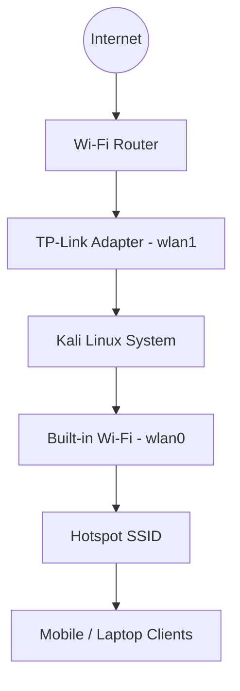

# NetBridge: Kali Hotspot

NetBridge sets up a Wi-Fi hotspot on Kali Linux. It uses **NetworkManager (`nmcli`)**. It shares internet from one adapter to another.

## Overview

This tool automates hotspot creation. It secures the connection with WPA2. It configures NAT and IP forwarding. This ensures internet for all clients.

### Network Roles

| Interface | Role | Description |
| :--- | :--- | :--- |
| `wlan0` | **Hotspot** | Acts as the Access Point. |
| `wlan1` | **Upstream** | Provides internet access. |

---

## Prerequisites

Check your system requirements:

* **OS**: Kali Linux. `NetworkManager` must be enabled.
* **Hardware**: 
    * One adapter with **AP mode** support.
    * One secondary internet source (USB, Ethernet, or Cellular).
* **Permissions**: Root or sudo access is required.

---

## Usage

Use the script for fast setup.

### 1. Configuration
Check `start.sh`. Ensure `HOTSPOT_IF` and `INTERNET_IF` match your hardware.

### 2. Execution
Run the script with sudo:
```bash
sudo ./start.sh
```

The script performs these tasks:
1. Restarts NetworkManager.
2. Deletes old "Hotspot" profiles.
3. Starts the new Wi-Fi Hotspot.
4. Enables IPv4 sharing and forwarding.
5. Sets IPTables rules for NAT.

---

## Network Diagram



---

## Verification & Troubleshooting

### Connectivity Checks
Check these if internet fails:
* **IP Forwarding**: File `/proc/sys/net/ipv4/ip_forward` must contain `1`.
* **NAT Rules**: The `MASQUERADE` rule must be in the `nat` table.
* **Interface Status**: Run `nmcli device status`. Check both adapters.

### Common Issues
* **AP Mode**: Some drivers lack AP support. Use `iw list` to check.
* **IP Conflicts**: The default subnet is `10.42.0.0/24`. Ensure it is unique.

---

## Cleanup

Remove the hotspot profile to revert:
```bash
sudo nmcli connection delete Hotspot
```
Flush temporary IPTables rules if needed.

---

## Notes
* The hotspot uses WPA2-PSK.
* NAT is required for bridging.
* This setup is for temporary sharing.

