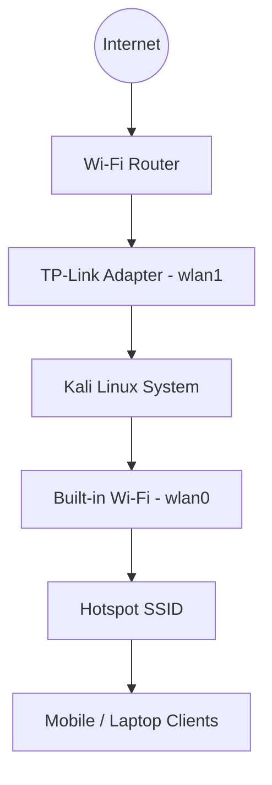

# NetBridge: Kali Linux Wi-Fi Hotspot

NetBridge is a streamlined solution for configuring a Wi-Fi hotspot on Kali Linux using **NetworkManager (`nmcli`)**. It facilitates sharing an existing internet connection from one network interface (e.g., a USB Wi-Fi adapter) to another (e.g., the built-in Wi-Fi adapter).

## Overview

The tool automates the process of creating a WPA2-protected Access Point and configuring the necessary NAT and IP forwarding rules to ensure seamless internet connectivity for connected clients.

### Network Architecture

| Interface | Role | Description |
| :--- | :--- | :--- |
| `wlan0` | **Hotspot** | Built-in Wi-Fi adapter acting as the Access Point. |
| `wlan1` | **Upstream** | Secondary adapter (USB/Ethernet) providing internet access. |

---

## Prerequisites

To use this setup, ensure your system meets the following requirements:

* **OS**: Kali Linux with `NetworkManager` enabled.
* **Hardware**: 
    * A Wi-Fi adapter capable of **Access Point (AP) mode** (typically the built-in card).
    * A secondary internet source (USB Wi-Fi adapter, Ethernet, or Cellular).
* **Permissions**: Root or sudo privileges are required for network configuration.

---

## Usage

Instead of manual configuration, use the provided automation script to set up the bridge.

### 1. Configuration
Review the `start.sh` script to ensure the interface names (`HOTSPOT_IF` and `INTERNET_IF`) match your system's hardware.

### 2. Execution
Run the script with sudo privileges:
```bash
sudo ./start.sh
```

The script will:
1. Restart NetworkManager.
2. Clean up any existing "Hotspot" profiles.
3. Initialize the new Wi-Fi Hotspot.
4. Enable IPv4 sharing and IP forwarding.
5. Configure IPTables for NAT and traffic forwarding.

---

## Network Diagram



---

## Verification & Troubleshooting

### Connectivity Checks
If clients connect but cannot access the internet, verify the following:
* **IP Forwarding**: Ensure `/proc/sys/net/ipv4/ip_forward` is set to `1`.
* **NAT Rules**: Confirm the `MASQUERADE` rule is active in the `nat` table of IPTables.
* **Interface Status**: Use `nmcli device status` to ensure both interfaces are connected and managed.

### Common Issues
* **AP Mode Support**: Not all Wi-Fi drivers support Access Point mode. If the hotspot fails to start, verify your hardware capabilities using `iw list`.
* **Subnet Conflicts**: By default, NetworkManager uses the `10.42.0.0/24` subnet. Ensure this does not conflict with your upstream network.

---

## Cleanup

To revert the changes and remove the hotspot configuration, you can delete the connection profile via NetworkManager:
```bash
sudo nmcli connection delete Hotspot
```
You should also flush the temporary IPTables rules if a persistent firewall is not being used.

---

## Notes
* The hotspot is secured with WPA2-PSK by default.
* IP forwarding and NAT are essential for the "bridge" functionality.
* This setup is designed for temporary network sharing and may require persistence configuration for long-term use.
